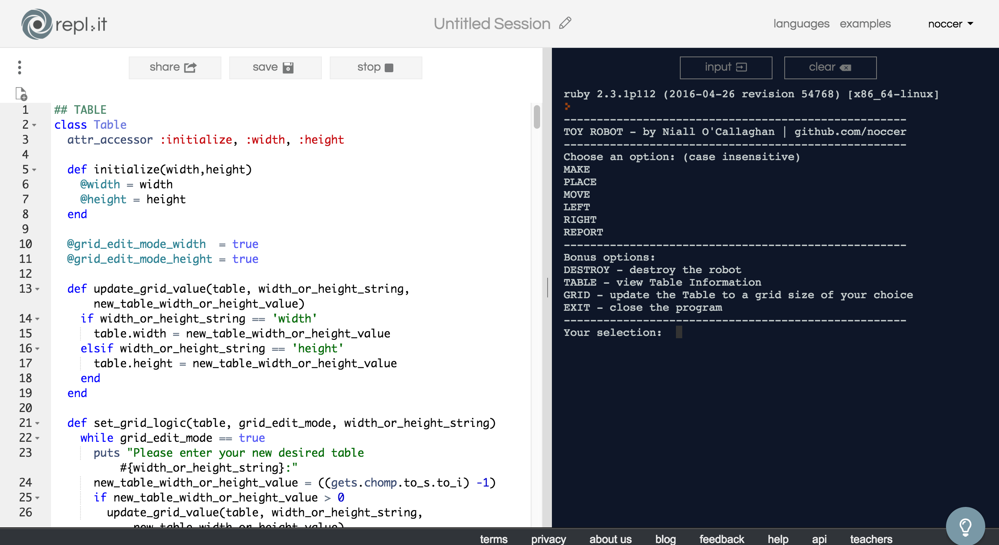
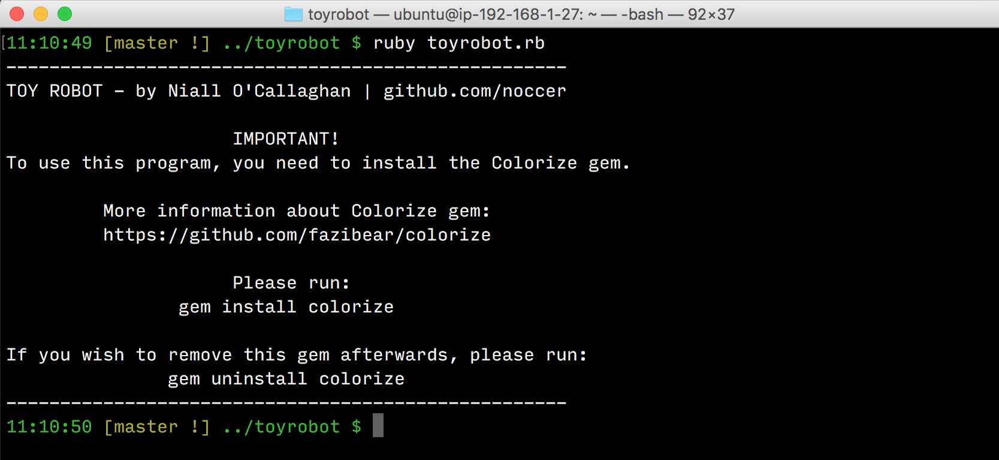
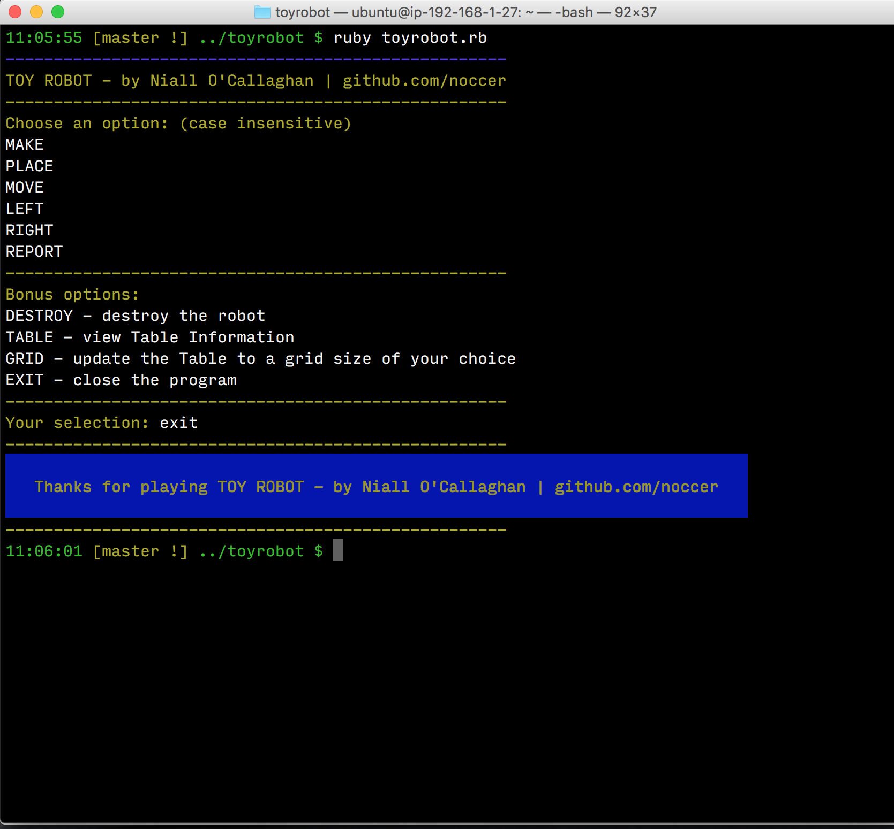
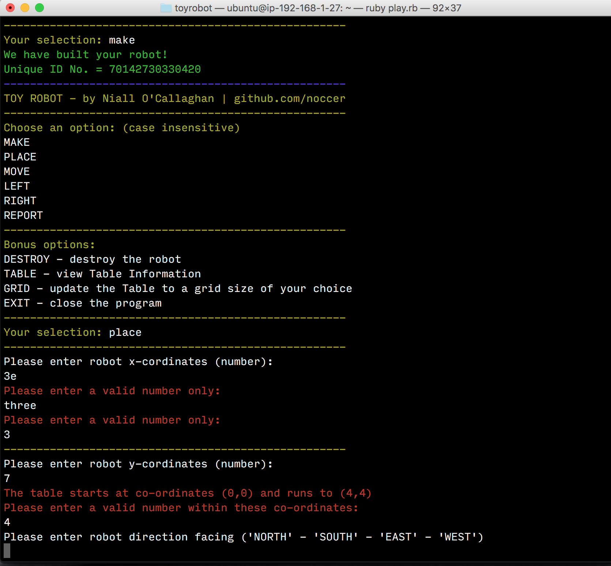

# Toy Robot Challenge

## by Niall O'Callaghan

This is my attempt at the Toy Robot Challenge in Ruby.

If you want to play it online, here's a truncated version (no colours) on Repl.it: [https://repl.it/Cny0/2](https://goo.gl/IaE7BF)

## How to play on Repl.it:

1. Visit the link above.
2. Click on the run button at the top of the page.
3. Start typing commands into the black window on the right hand side.
4. Sadly, this online version will not work with Colorize gem (see [Things to Note](#things-to-note) below)



## Technical Requirements

Requirements to run the app on your machine:

- Ruby 2.2.2 or above
- Bash terminal

## Installation Instructions:

Open your terminal and run:

```
git clone https://github.com/noccer/Toy-Robot-Test-Ruby.git
```

Alternatively [download](https://github.com/noccer/Toy-Robot-Test-Ruby/archive/master.zip) the code and extract it on your local machine.

To use the app, you must use the Colorize gem (see [Things to Note](#things-to-note) below), but you will be prompted for this at runtime if you do not have it installed.



--------------------------------------------------------------------------------

## How to Play the Game:

1. To start the app, open your terminal in the toyrobot directory.
2. run `ruby play.rb`.
3. Follow the instructions on screen. All commands are case insensitive.
4. Hit `CTRL + C` at any time to return to the main menu.
5. **IMPORTANT:** To exit, simply type `EXIT` from the main menu. To get to the main menu at any time, hit `CTRL + C` as mentioned above.

> Have fun!

## Screenshots





## Things to Note:

- I designed this completely alone, I wanted to make the app in a manner that made the most sense to me.
- I tried to minimise the use of gems, but made one single exception by adding [Colorize](https://github.com/fazibear/colorize). I wanted to give my version of Toy Robot a bit of color, I think it really adds to the User Experience.
- I went slightly off brief with how the PLACE command is entered. I opted to do this for a better User Experience - No brackets or commas required etc, simply follow prompts.

## Improvements:

- More commenting (work in progress)
- Refactoring of repeated code is needed. **Lots of refactoring**.
- Create a master file for the menu, then move play.rb robot.rb and table.rb classes into a subfolder.

## Known Bugs and Errors:

- None!
- Please contact me if you find a bug or want to just say hello.

  - [noccer.com](http://noccer.com)

--------------------------------------------------------------------------------

# Original Brief:

--------------------------------------------------------------------------------

**Toy Robot Simulator challenge**

Description:

- The application is a simulation of a toy robot moving on a square tabletop, of dimensions 5 units x 5 units
- There are no other obstructions on the table surface
- The robot is free to roam around the surface of the table, but must be prevented from falling to destruction
- Any movement that would result in the robot falling from the table must be prevented, however further valid movement commands must still be allowed

  Create an application that can read in commands of the following form -

PLACE X,Y,F

MOVE

LEFT

RIGHT

REPORT

PLACE will put the toy robot on the table in position X,Y and facing NORTH, SOUTH, EAST or WEST.

The origin (0,0) can be considered to be the SOUTH WEST most corner.

The first valid command to the robot is a PLACE command, after that, any sequence of commands may be issued, in any order, including another PLACE command. The application should discard all commands in the sequence until a valid PLACE command has been executed.

MOVE will move the toy robot one unit forward in the direction it is currently facing.

LEFT and RIGHT will rotate the robot 90 degrees in the specified direction without changing the position of the robot.

REPORT will announce the X,Y and F of the robot. This can be in any form, but standard output is sufficient.

A robot that is not on the table can choose the ignore the MOVE, LEFT, RIGHT and REPORT commands.

Input can be from a file, or from standard input, as the developer chooses.

Provide test data to exercise the application.

Constraints: The toy robot must not fall off the table during movement. This also includes the initial placement of the toy robot. Any move that would cause the robot to fall must be ignored.

Example Input and Output:

a) PLACE 0,0,NORTH MOVE REPORT Output: 0,1,NORTH

b) PLACE 0,0,NORTH LEFT REPORT Output: 0,0,WEST

c) PLACE 1,2,EAST MOVE MOVE LEFT MOVE REPORT Output: 3,3,NORTH

Deliverables: The Ruby source files, the test data and any test code. It is not required to provide any graphical output showing the movement of the toy robot.
